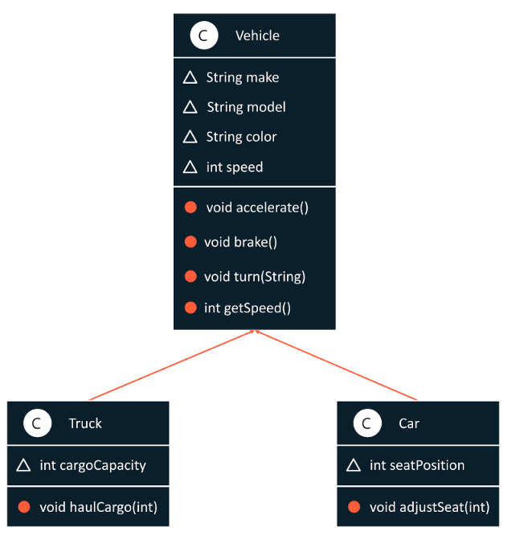

# Inheritance

- code can inherit properties from other pieces of code
- Reuse code and create new things by inheriting or reusing features of something already built

- car object
    - create a monster truck by inheriting properties from the car object and create new features to fit the monster truck
    - The car object is known as a **super class**
        - defines the common properties and functionalities
    - Any other object that inherits from the car class is a subclass
        - inherits from the super class
    
```java
pubilc class Car extends Vehicle{

}
```
- Above displays how to create subclass that inherits from the super class

## Inheritance in action
- when you create a car class that extends the vehicle class, some default things happen if some stuff isnt explicity declared
    - the subclass invokes the superclass constructor automatically
        - this allows the sub class to inherit the default constructor of the vehicle class
        - super() points to the superclass
    - it does this automatically for the default or no-argument constructors
    - It does not do with parameterized constructors
```java
public Car(String make, String model, String color){
    super(make, model, color);
    this.seatPosition = 0;
    System.out.println("Car Created");
}
```
- an explicit call must be made to the super class along with the parameters that are required
- Now whenever we create a car, we can access the properties and functions within the vehicle class due to the car class inheriting those features from the vehicle class

## Single-level inheritance
- inheriting from one level above 
    - car <-inherit vehicle

## Multi-level inheritance
- inheriting from over more than one level
    - sports car <- car <- vehicle

## hierarchical inheritance
- two different types of vehicles inheriting from the same super class 
    - they are siblings in hierarchical terms 


# Understanding the super class
- how to enhance and reuse a superclass
- example used in the video shows the multilevel inheritence 

```java
public class SportsCar extends Car{
    int turboboost;

    public SportsCar(String make, String model, String color){
        super(make, model, color);
        this.turboBoose = 0;
        System.out.println("SportsCar Created.");
    }

    public void activateTurboBoost(){
        super.accelerate(); // use super to call methods in the super classes
        this.turboBoost += 50;
        super.speed += turboBoost;
        System.out.println("Turbo boost activated");
    }
}
```

```java
//Example shown in video

public class Main{

    public static void main(String[] args){
        Car tesla = new Car("Tesla", "Model s", "Red");

        Car gt = new Car("Ford", "GT", "Black");

        tesla.accelerate(); //using inherited methods

        tesla.brake();
    }

    SportsCar ferrari = new SportsCar("ferrari", "E8", "Yellow");
    ferrari.turboBoost;
    System.out.println(ferrari.getSpeed());
}
```

# Polymorphism
- Ability of a method to behave differenly based on the objects it interacts with
- method overloading
    - allows class to have multiple methods with the same name but different arguments
- method overriding
    - allows a subclass to provide a specific implementation of a method in the superclass

## Benefits of polymorphism
- Enhances code resuabi   lity
- adds flexbility 
- improves maintainability
- Increases complexity in the code
